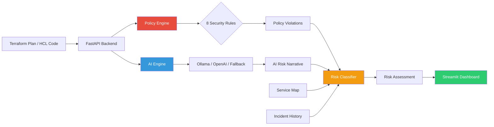

# 🛡️ ReleaseShield AI

**AI-Powered Infrastructure Governance & Safety Gate**

[](https://github.com/jayachandra-poldasu/releaseshield-ai/actions)
[](https://www.python.org/downloads/)
[](LICENSE)

ReleaseShield AI is a proactive SRE tool designed to eliminate **toil** in the infrastructure review process. It uses a **deterministic policy engine** combined with **Generative AI** to analyze Terraform plans against enterprise security policies before they reach production.

---

## ⚡ Int Quick Start (Copy-Paste Ready)

> **Everything below runs without GPU, API keys, or Docker.** Just Python 3.11+.

### Step 1 — Clone & Setup (30 seconds)

```bash
git clone https://github.com/jayachandra-poldasu/releaseshield-ai.git
cd releaseshield-ai
python3 -m venv venv && source venv/bin/activate
pip install -r requirements.txt -r requirements-dev.txt
```

### Step 2 — Run Tests (show 85 tests passing, 89% coverage)

```bash
pytest tests/ -v --tb=short --cov=app --cov-report=term-missing
```

**Expected output:**
```
tests/test_policy_engine.py   — 30 passed  (8 security rules, classification, incidents)
tests/test_ai_engine.py       — 15 passed  (mocked LLM backends, fallback, health)
tests/test_api.py             — 12 passed  (all 4 API endpoints, validation)
tests/test_models.py          — 11 passed  (Pydantic model validation)
========================= 85 passed in ~1s =========================
TOTAL coverage: 89%
```

### Step 3 — Start API Server

```bash
RELEASESHIELD_AI_BACKEND=none uvicorn app.main:app --reload
```

> Server starts at http://localhost:8000 — open http://localhost:8000/docs for Swagger UI

### Step 4 — Test the API (open a 2nd terminal)

**4a. Health Check:**
```bash
curl -s http://localhost:8000/health | python3 -m json.tool
```

**4b. List Services:**
```bash
curl -s http://localhost:8000/services | python3 -m json.tool
```

**4c. Analyze RISKY Terraform (triggers HOLD — the key demo):**
```bash
curl -s -X POST http://localhost:8000/analyze \
  -H "Content-Type: application/json" \
  -d '{
    "service_name": "auth-service",
    "environment": "Production",
    "terraform_code": "resource \"google_compute_firewall\" \"bad\" {\n  allow { protocol = \"all\" }\n  source_ranges = [\"0.0.0.0/0\"]\n}\nresource \"google_project_iam_binding\" \"pub\" {\n  members = [\"allUsers\"]\n}",
    "dry_run": true
  }' | python3 -m json.tool
```

**Expected: `"classification": "HOLD"` with policy violations R001, R005, R002 and matched historical incidents.**

**4d. Analyze SAFE Terraform (triggers SAFE):**
```bash
curl -s -X POST http://localhost:8000/analyze \
  -H "Content-Type: application/json" \
  -d '{
    "service_name": "monitoring-agent",
    "environment": "Development",
    "terraform_code": "resource \"google_compute_instance\" \"safe\" {\n  name = \"test\"\n  machine_type = \"e2-medium\"\n  labels = { env = \"dev\", team = \"sre\" }\n}",
    "dry_run": true
  }' | python3 -m json.tool
```

**Expected: `"classification": "SAFE"` with zero violations.**

### Step 5 — Launch Streamlit Dashboard (optional, impressive for live demo)

```bash
streamlit run ui.py
```

> Opens at http://localhost:8501 — use the **"Load Risky Example"** button for instant demo.

### Step 6 — Run Lint (zero errors)

```bash
ruff check app/ tests/
```

---

## 🎯 Int Talking Points

### "Walk me through how this works"

> 1. User pastes Terraform code → hits `/analyze` endpoint
> 2. **Policy Engine** runs 8 deterministic security rules (0.0.0.0/0, allUsers IAM, missing encryption, public GKE clusters, etc.)
> 3. Each violation has a severity (Critical/High/Medium) that maps to a classification impact
> 4. **Incident Cross-Reference** matches violations against historical failure patterns for that service
> 5. **Risk Classifier** combines: violations + service criticality + environment + dependency count → SAFE / CANARY / HOLD
> 6. If an AI backend is connected, it generates a narrative risk summary using structured prompt engineering
> 7. **Rollout Guidance** is generated with specific SRE recommendations (canary %, monitoring duration, downstream checks)

### "Why not just use ChatGPT?"

> The policy engine is **deterministic** — same input always gives same output. AI is supplementary, not required.
> The tool works fully offline with `AI_BACKEND=none`. This is critical for:
> - **Reliability** — no API outages affect the safety gate
> - **Auditability** — every HOLD decision is traceable to specific rule violations
> - **Speed** — policy checks run in milliseconds vs seconds for LLM calls

### "How is this different from a prompt wrapper?"

> - 8 real security rules with regex pattern matching (`policy_engine.py`)
> - Historical incident cross-referencing with repeat failure detection
> - Service dependency graph for blast radius estimation
> - Confidence scoring based on violation severity + service criticality + environment
> - 85 unit + integration tests at 89% coverage — the policy engine is tested independently of AI

---

## 🏗️ Architecture



### Analysis Pipeline

1. **Policy Engine** — Deterministic rule-based checks (8 GCP/cloud security policies)
2. **Incident Cross-Reference** — Matches current violations with historical failure patterns
3. **Risk Classification** — Combines violations, service criticality, environment, and dependency data
4. **AI Analysis** — LLM-generated narrative explaining risk drivers and rollout guidance
5. **Rollout Recommendation** — SAFE / CANARY / HOLD with specific SRE safety steps

---

## 🔑 Key Features

| Feature | Description |
|---------|-------------|
| **Automated Policy Enforcement** | 8 deterministic security rules (public IPs, IAM, encryption, GKE, firewalls, etc.) |
| **Risk Classification** | SAFE → CANARY → HOLD based on violations, criticality, and environment |
| **Blast Radius Estimation** | Uses service dependency mapping and SLA tiers |
| **Incident Pattern Matching** | Cross-references new changes with historical failures |
| **AI-Generated Summaries** | Contextual risk narratives via Ollama (local) or OpenAI |
| **Pluggable AI Backend** | Works with Ollama, OpenAI, or fully offline (policy-engine only) |
| **Service Dependency Map** | JSON-based service ownership, team, and SLA metadata |
| **Interactive Dashboard** | Streamlit UI with sample Terraform loaders for instant demos |

---

## 🔒 Policy Rules

| Rule | Check | Severity | Classification |
|------|-------|----------|----------------|
| R001 | Public IP / `0.0.0.0/0` CIDR block | Critical | HOLD |
| R002 | `allUsers` / `allAuthenticatedUsers` IAM binding | Critical | HOLD |
| R003 | Missing encryption configuration | High | CANARY |
| R004 | Missing resource labels/tags | Medium | CANARY |
| R005 | Overly permissive firewall (`protocol = "all"`) | Critical | HOLD |
| R006 | Auto-scaling disabled on GKE node pool | Medium | CANARY |
| R007 | Public GKE cluster (missing `private_cluster_config`) | Critical | HOLD |
| R008 | Deletion protection disabled / `force_destroy = true` | High | CANARY |

---

## 📡 API Endpoints

| Method | Endpoint | Description |
|--------|----------|-------------|
| `POST` | `/analyze` | Run full release risk analysis |
| `GET` | `/health` | Health check with AI backend status |
| `GET` | `/services` | List all registered services |
| `GET` | `/history/{service_name}` | Incident history for a service |
| `GET` | `/docs` | Interactive Swagger documentation |

### Example Response (`POST /analyze`)

```json
{
  "classification": "HOLD",
  "blast_radius": "High",
  "confidence_score": 1.0,
  "policy_violations": [
    {
      "rule_id": "R001",
      "rule_name": "Public IP / Open CIDR Block",
      "severity": "Critical",
      "message": "Detects unrestricted network access via 0.0.0.0/0 CIDR blocks..."
    },
    {
      "rule_id": "R005",
      "rule_name": "Overly Permissive Firewall Rule",
      "severity": "Critical",
      "message": "Firewall rules allowing all protocols increase attack surface..."
    }
  ],
  "matched_incidents": [
    {
      "service": "auth-service",
      "issue": "Public endpoint exposed after firewall rule misconfiguration",
      "severity": "Critical",
      "date": "2025-08-22",
      "root_cause": "Firewall rule allowed 0.0.0.0/0 ingress during network migration",
      "mttr_hours": 1.2
    }
  ],
  "rollout_guidance": "🚨 HOLD RELEASE — Do not deploy to Production. Escalate to service owner (Sarah Chen)...",
  "service_context": {
    "criticality": "Critical",
    "dependencies": ["payment-api", "user-dashboard", "gateway-proxy"],
    "owner": "Sarah Chen",
    "team": "Platform Engineering",
    "sla_tier": "Tier-1 (99.99%)"
  }
}
```

---

## 🧪 Testing

```bash
# Run full test suite with coverage
pytest tests/ -v --tb=short --cov=app --cov-report=term-missing

# Run specific test file
pytest tests/test_policy_engine.py -v

# Lint check
ruff check app/ tests/
```

| Test File | Tests | What's Tested |
|-----------|-------|---------------|
| `test_policy_engine.py` | 30 | All 8 rules (positive + negative), classification, blast radius, incident cross-referencing, rollout guidance |
| `test_ai_engine.py` | 15 | Prompt construction, Ollama/OpenAI dispatch (mocked), fallback analysis, health checks |
| `test_api.py` | 12 | All 4 endpoints, request validation (422), unknown service (404), response schema |
| `test_models.py` | 11 | Pydantic validation, enum values, confidence score bounds |
| **Total** | **85** | **89% code coverage** |

---

## 🗂️ Project Structure

```
releaseshield-ai/
├── app/
│   ├── __init__.py          # Package metadata & version
│   ├── main.py              # FastAPI app with 4 endpoints
│   ├── models.py            # Pydantic request/response schemas
│   ├── policy_engine.py     # 8 deterministic security rules + classifier
│   ├── ai_engine.py         # Pluggable LLM integration (Ollama/OpenAI/fallback)
│   ├── config.py            # Settings via pydantic-settings & env vars
│   └── utils.py             # Helpers & sample Terraform snippets
├── data/
│   ├── service_map.json     # 5 services with owner, team, SLA, dependencies
│   ├── incident_history.json# 7 incidents with dates, root cause, MTTR
│   └── policies.json        # Policy rule definitions with remediation
├── tests/
│   ├── conftest.py          # Shared fixtures (temp data dirs, sample code)
│   ├── test_policy_engine.py# 30 tests
│   ├── test_ai_engine.py    # 15 tests (mocked HTTP)
│   ├── test_api.py          # 12 integration tests (FastAPI TestClient)
│   └── test_models.py       # 11 validation tests
├── ui.py                    # Streamlit dashboard (3 pages)
├── Dockerfile               # Multi-stage build, non-root, healthcheck
├── docker-compose.yml       # API + UI + Ollama (3 services)
├── Makefile                 # make test | make run | make lint
├── requirements.txt         # Production dependencies
├── requirements-dev.txt     # Test/dev dependencies (pytest, ruff)
├── .env.example             # All config options documented
└── .github/workflows/ci.yml # Lint → Test → Docker Build
```

---

## 🛠️ Tech Stack

| Category | Technologies |
|----------|-------------|
| **Backend** | Python, FastAPI, Pydantic, Uvicorn |
| **AI/LLM** | Ollama (Llama 3), OpenAI API, Prompt Engineering |
| **Frontend** | Streamlit, Pandas |
| **Data** | JSON-based service maps, incident history, policy rules |
| **Testing** | Pytest, pytest-cov, unittest.mock |
| **DevOps** | Docker, Docker Compose, GitHub Actions CI/CD |
| **Linting** | Ruff |

---

## 🐳 Docker Setup

```bash
# Full stack (API + UI + Ollama)
docker-compose up --build

# Access:
#   API:     http://localhost:8000
#   UI:      http://localhost:8501
#   Swagger: http://localhost:8000/docs
```

---

## 📄 License

This project is for educational and portfolio purposes.

---

Built by [Jayachandra Poldasu](https://www.linkedin.com/in/jayachandra-poldasu/) as a demonstration of AI-assisted SRE tooling.
